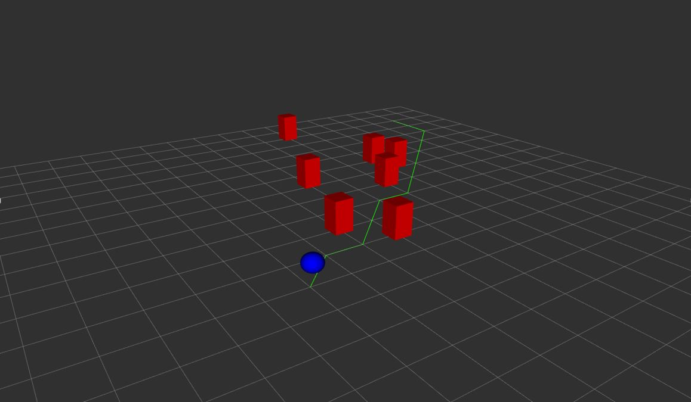

# О проекте drone_nav_ros2 
**Цель**: Обеспечить построение и корректное следование по маршруту дроном между заданными точками на карте с возможностью перепланирования пути при появлении препятствий

Данный проект представляет собой имитационную модель автономного дрона, с поддержкой планирования и перепланирования маршрута в двумерном пространстве при наличии статических и динамических препятствий.


## Технологии, используемые при разработке

- **ROS 2 Humble** – фреймворк для разработки робототехнических приложений  
- **Python 3.10** – основной язык
- **RViz 2** – визуализация 
- **Colcon** – сборка ROS 2 пакетов  
- **WSL 2** – среда разработки на Windows  

# Руководство по установке 
Сперва необходимо клонировать проект
```bash
git clone https://github.com/PivIrina/drone_nav_ros2.git
```
Переходим в репозиторий установки и собираем проект
```bash
colcon build
```
Настраиваем окружение
```bash
source /opt/ros/humble/setup.bash   # окружение ROS
source ./install/setup.bash
```
Для запуска проекта единовременно всех нод выполняем
```bash
ros2 launch drone_nav_py simulation_launch.py
```
В launch-файле также можно изменить стартовые параметры симмуляции.


